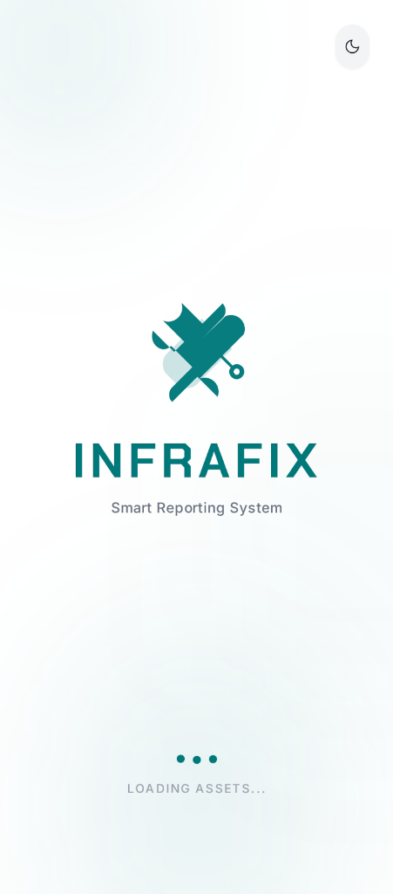
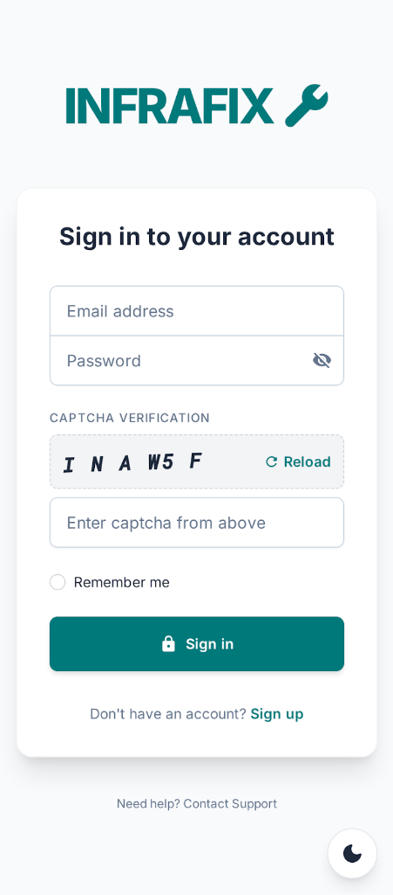
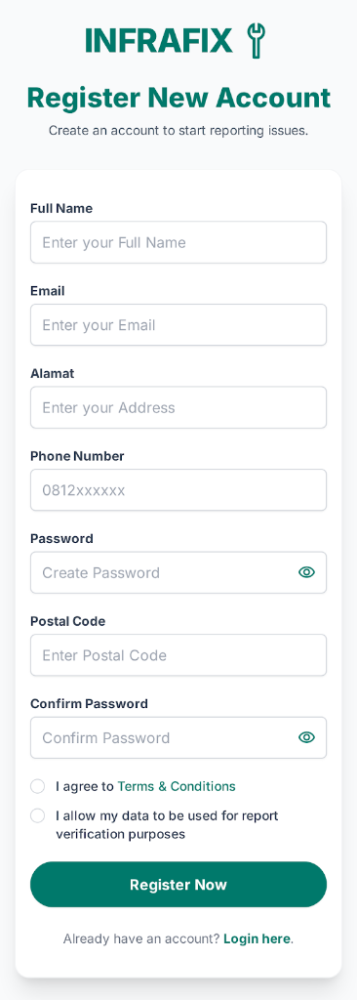
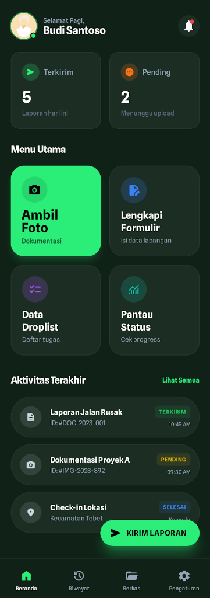
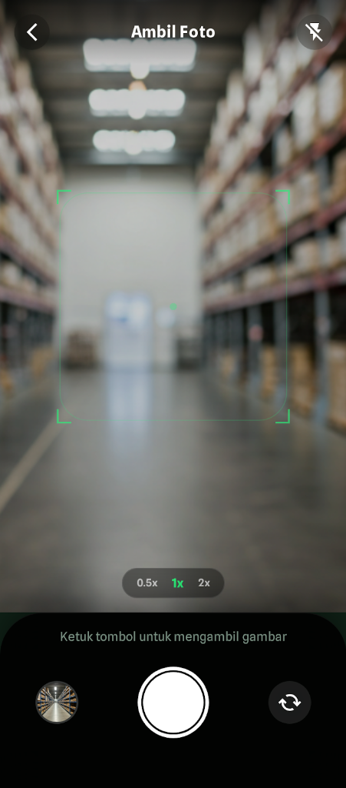
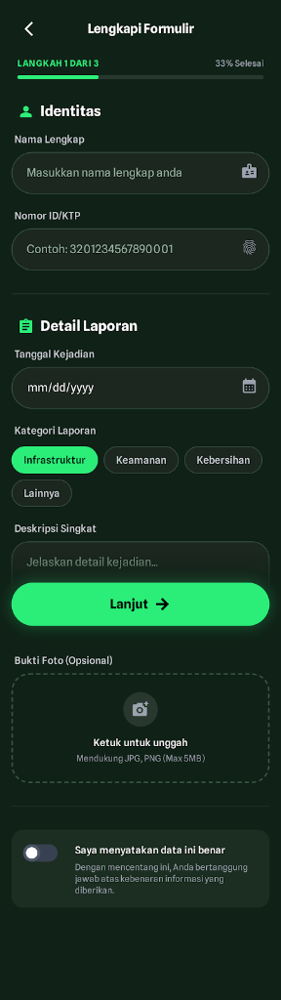
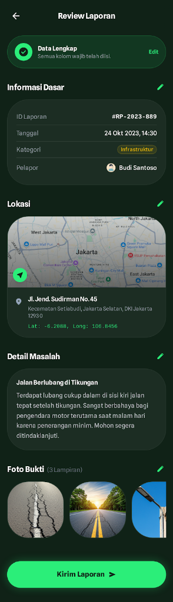
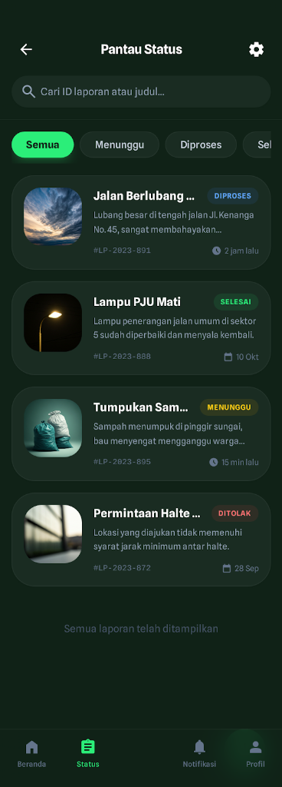

# InfraFix App - Mobile Backend & Frontend Design

Backend application for the InfraFix citizen reporting system, built with Spring Boot 3.4.10.

## 📱 Design Preview

| Splash Screen | Login | Register |
|:---:|:---:|:---:|
|  |  |  |
| **Welcome**: Layar pembuka aplikasi. | **Sign In**: Masuk ke akun pengguna. | **Sign Up**: Pendaftaran akun baru. |

| Home / Dashboard | Camera / Dokumentasi |
|:---:|:---:|
|  |  |
| **Menu Utama**: Ambil Foto, Lengkapi Formulir, Drop List, Pantau Status. | **Fitur Kamera**: Mengambil foto bukti Infrastruktur rusak. |

| Form Laporan | Review Laporan |
|:---:|:---:|
|  |  |
| **Input Data**: Kategori, Detail, dan Lampiran Foto. | **Review**: Memastikan data sebelum dikirim. |

| Pantau Status |
|:---:|
|  |
| **Status Tracking**: Menunggu, Diproses, Selesai, Ditolak. |

---

## 🚀 Features

### 👤 User Roles
1.  **Citizen**: 
    *   Register & Login.
    *   Create Report (Title, Desc, Photo, Location).
    *   Track Report Status.
2.  **Admin**:
    *   Manage Reports (Change Status & Category).
    *   View Global Dashboard.
3.  **Technician**:
    *   View Assigned Reports.

### 🛠 Tech Stack
*   **Java 21**
*   **Spring Boot 3.3.0**
*   **PostgreSQL** (Database)
*   **Spring Security + JWT** (Authentication)
*   **Lombok**
*   **JPA / Hibernate**
    
### 📦 Libraries & Dependencies
*   **Spring Boot Starter Web**: RESTful API framework.
*   **Spring Boot Starter Data JPA**: Database abstraction and O/R mapping.
*   **Spring Boot Starter Security**: Authentication and access control.
*   **Spring Boot Starter Validation**: Bean validation (JSR-380).
*   **PostgreSQL Driver**: JDBC driver for PostgreSQL database.
*   **Lombok**: Annotation-based boilerplate code reducer.
*   **JJWT (Api, Impl, Jackson)**: JSON Web Token support for security.
*   **Spring Boot Starter Test**: Integration and unit testing.

## 📂 Project Structure

```
com.mobile.infrafixapp
├── config          # App & Security Config
├── controller      # REST API Endpoints
├── dto             # Data Transfer Objects
│   ├── request     # Request Payloads
│   └── response    # Response Objects
├── handler         # Global Exception Handling
├── model           # Database Entities (User, Report, Role)
├── repository      # JPA Repositories
├── security        # JWT Filter & Service
├── service         # Business Logic
└── validation      # Validator Classes
```

## 🔌 API Endpoints

### 🔐 Otentikasi
*   `POST /api/v1/auth/register` - Mendaftar akun pengguna baru.
*   `POST /api/v1/auth/authenticate` - Login pengguna & pembuatan token JWT.

### 👥 Manajemen Pengguna
*   `DELETE /api/v1/users/{id}` - Menghapus akun pengguna (Khusus Admin).

### 📋 Laporan
*   `POST /api/v1/reports` - Mengirim laporan baru (Multipart: JSON + Gambar) (Warga).
*   `GET /api/v1/reports/my` - Mengambil laporan yang dibuat oleh pengguna saat ini (Warga).
*   `GET /api/v1/reports` - Mengambil semua laporan (Admin & Teknisi).
*   `PATCH /api/v1/reports/{id}/status` - Memperbarui status laporan (Admin & Teknisi).
*   `GET /api/v1/reports/categories` - Mengambil semua kategori laporan.
*   `POST /api/v1/reports/categories` - Menambah kategori laporan baru (Admin).

### 🔔 Notifikasi
*   `GET /api/v1/notifications` - Mengambil notifikasi pengguna saat ini.

### 💬 Chat (Asisten AI)
*   `POST /api/v1/chat` - Mengirim pesan ke asisten AI (Gemini).

### 📰 Berita
*   `GET /api/v1/news/prospects` - Mengambil berita/prospek berdasarkan kategori dan wilayah.

### 📂 Sumber Daya Statis
*   `GET /uploads/{filename}` - Mengakses gambar yang diunggah.

## 🏃‍♂️ How to Run

1.  **Configure Database**: Update `application.properties` with your PostgreSQL credentials.
2.  **Run Application**: `mvn spring-boot:run`
3.  **API Docs**: Access endpoints via Postman or Swagger (if enabled).

